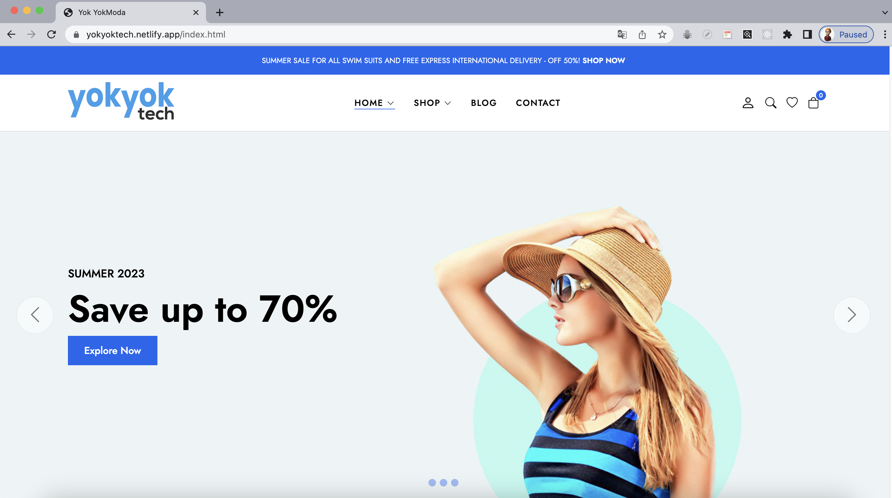

# Project : E-Commerce Website Design

## Description

Project aims to create a e-commerce site.

## Project Skeleton

```
E-Commerce Website Design (folder)
|
|----readme.md                                  # Definition of the project
|----solution
        |----CSS (folder)
              |----components
                  |----single-product
                         |----breadcrumb.css
                         |----product-gallery.css
                         |----product-info.css
                         |----product-tabs.css
                  |----blog-item.css
                  |----campaign-item.css
                  |----campaign-single.css
                  |----category-item.css
                  |----modal-dialog.css
                  |----modal-search.css
                  |----product-item.css
                  |----reviews.css
                  |----slider.css
              |----layout (folder)
                    |----footer.css
                    |----header.css
              |----pages (folder)
                    |----account.css
                    |----blog.css
                    |----cart.css
                    |----contact.css
                    |----home.css
                    |----single-blog.css
                    |----single-product.css
                 |----base.css
                 |----main.css
        |----img (folder)                        # Images of the project
        |----Js (folder)
                 |----singe-product
                    |----colors.js
                    |----comments.js
                    |----tabs.js
                    |----thumbsActive.js
                    |----values.js
                    |----zoom.js
              |----cart.js
              |----glide.js
              |----header.js
              |----main.js
              |----product.js
              |----search.js
              |----single-product.js
              |----slider.js


    |----index.html
    |----shop.html
    |----cart.html
    |----blog.html
    |----contact.html
    |----account.html

```

## Outcome

🔗 [e-commerce website](https://yokyoktech.netlify.app/index.html)

<br>




### The following issues are covered in the project;

- HTML

- CSS

- Js

## Resources

- [Images](./img)
